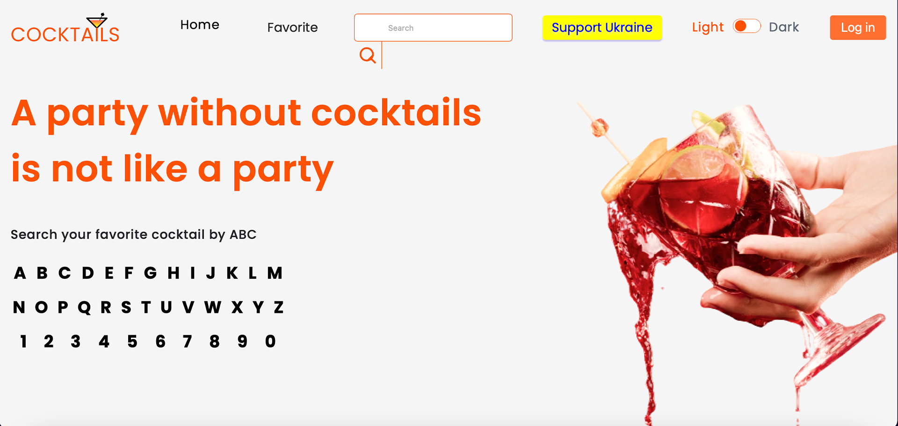
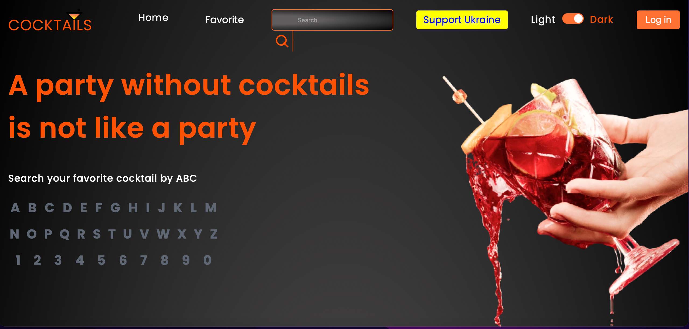
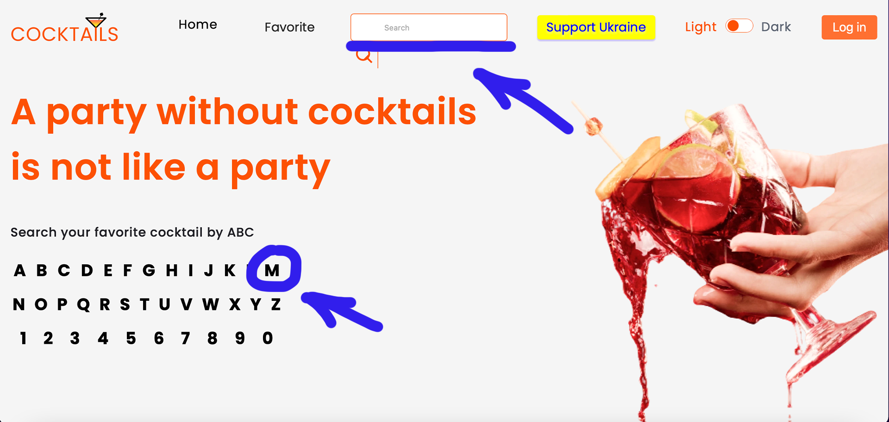
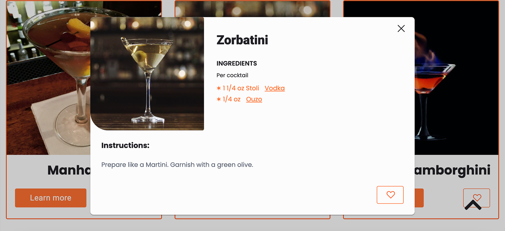
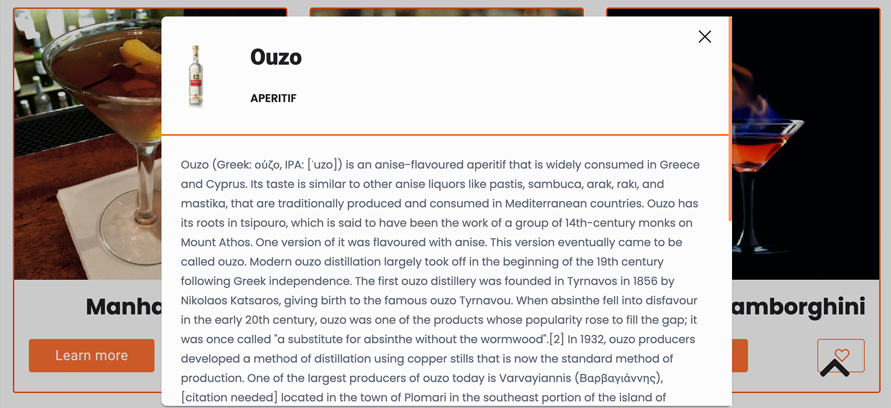
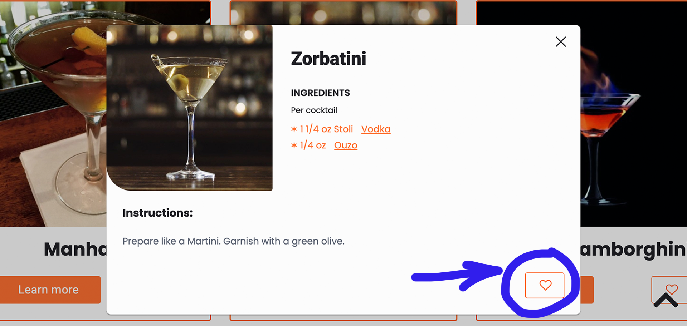
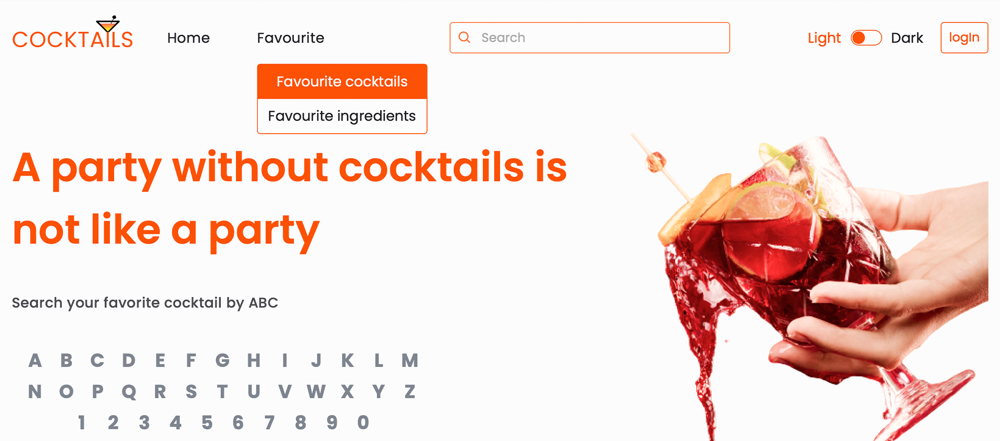
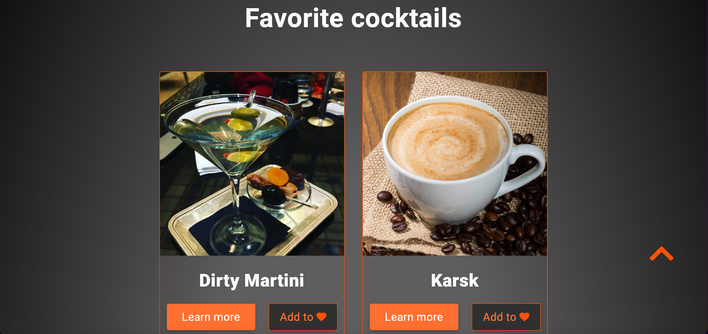
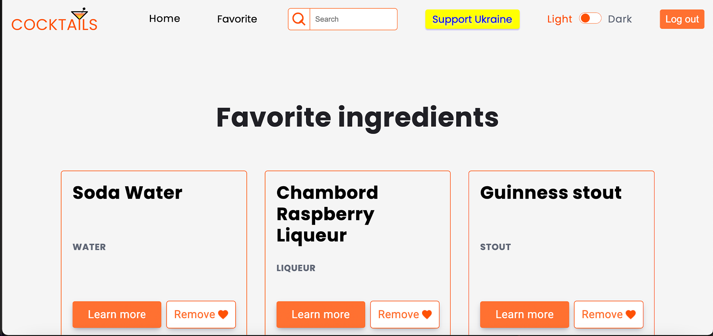
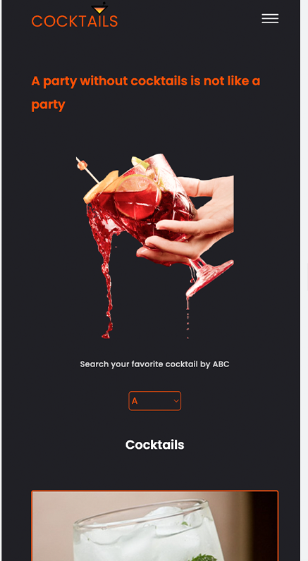

<h1 align="center">Cocktail application.</h1>

Thanks to this application, you can prepare any cocktail. You just need to find a cocktail, look at its ingredients and how it is made.

Dark theme implemented in the application for ease of use

<ul align="left">There are several functions to search for cocktails:</ul>
<li>you can enter the name coctail in the search bar</li>
<li>you can use alphabetical search, you need to click on the first letter of the cocktail name</li>
<li>you can just reload the page and get a random list of cocktails</li>

if you click on a cocktail - you can read its description and ingredients

If you click on the ingredients - you can read their description

Also, the application has an authorization function for saving your favorite cocktails and ingredients.

 

An adaptive version of the application has been implemented for use on mobile devices

